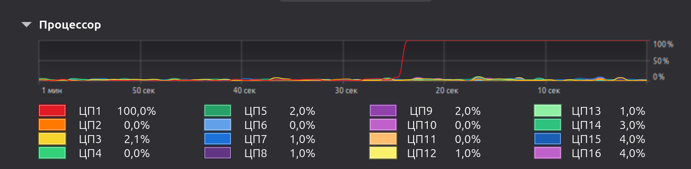
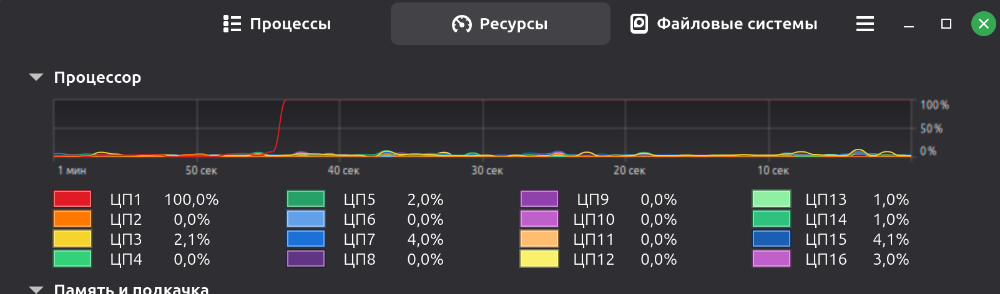

# Мандельброт

## Описание проекта

Проект реализует рендеринг множества Мандельброта с использованием библиотеки **Raylib**.  
Цель — сравнить производительность 4 версий программы с разными уровнями оптимизации:

- **mald1** — базовая версия (без оптимизаций)
- **mald2** — ручная векторизация на 8 элементах (без AVX)
- **mald3** — эмуляция AVX через функции

- **mald4** — аппаратная векторизация AVX2

---

## Методы оптимизации

| Версия | Описание | Ключевые особенности |
|--------|----------|----------------------|
| **mald1** | отрисовка по одному пискелю | Последовательные циклы, попиксельный рендеринг|
| **mald2** | Искусственная векторизаци массивами по 8 элементов | Явное разворачивание циклов, отрисова 8 пикселей за итерацию |
| **mald3** | Эмуляция AVX | Самодельные `mm256` функции (на самом деле скалярные) |
| **mald4** | Аппаратная векторизация | Intrinsic-функции: `_mm256_mul_ps`, `_mm256_fmadd_ps`, `_mm256_cmp_ps`, и т.д. |

## Методика тестирования

**Процессор**: 12th Gen Intel i7-1270P с максимальной частотой 4.800GHz. 

**Ядра**: Данный процессор имеет P-ядра и E-ядра, поэтому все тесты проводились на закрпеленном P - ядре (Core 0) через 
```bash 
taskset -c 0
```
**Состояние ядер процессора в "*Мониторинг ресурсов*" при запуске программ:**




**Замеры**: perf stat для сбора аппаратных счётчиков

**Количество тестов**: 10 запусков на каждую версию

**Условная компиляция**: BENCHMARK_MODE (1000 кадров без отрисовки)

**Пауза между тестами**: 60 секунд для стабилизации температуры

**Нюансы**: переменная **N** счётчик убегания точек множества Мандельброта, должна быть объявлена так:
```bash
volatile uint8_t N
```
Для того, чтобы при оптимизации без отрисовки -O3 не выбрасывал цикл расчета принадлежнасти пикселя множеству Мандельброта.

## Рендеринг

В проекте используется графическая библиотека **Raylib** для отрисовки множества Мандельброта.

Вот некоторые примеры результатов рендеринга:


# Результаты бенчмарка множества Мандельброта

## Таблица производительности

| Версия | Среднее время (сек) | ± (сек) | Отн. погрешность | Ускорение (раз) |
|--------|--------------------|---------|------------------|-----------------|
| **mald1**| 70.718 | ±1.170 | 1.65% | 1.00× |
| **mald2** | 36.881 | ±0.584 | 1.58% | 1.92× |
| **mald3** | 37.121 | ±0.419 | 1.13% | 1.91× |
| **mald4** | 9.135 | ±0.218 | 2.39% | 7.74× |

## Вывод

1. **mald4 быстрее mald1 в 7.74×** — это связано с тем, что были использованы SIMD-инструкции и intrinsic-функции, которые за одну инструкцию обрабатывают 8 чисел одновременно. Аппаратная векторизация даёт максимальный эффект.

2. **mald2 быстрее mald1 в 1.92x** — прирост производительности обусловлен уменьшением количества итераций внешнего цикла в 8 раз за счёт групповой обработки пикселей (по 8 за итерацию). Однако отсутствие аппаратной SIMD-векторизации не позволяет достичь теоретического предела ускорения в 8×

3. **mald3 и mald 4индентичны по скорости** - Несмотря на введение функций, их реализация осталась скалярной (те же циклы). Компилятор не может автоматически векторизовать эти функции.

## Компиляция

Все версии компилируются с флагами:
```bash
g++ -O3 -NBENCHMARK_MODE -march=native -mavx2 mald_ver_X.cpp -o maldX -lraylib -lX11 -lpthread -ldl -lrt -lm